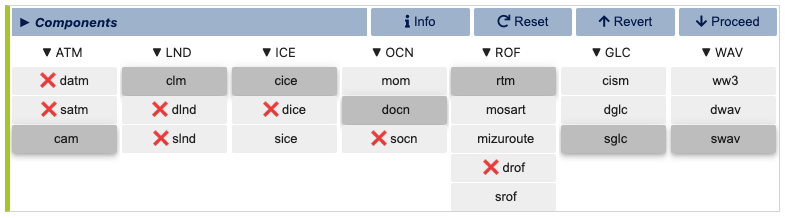
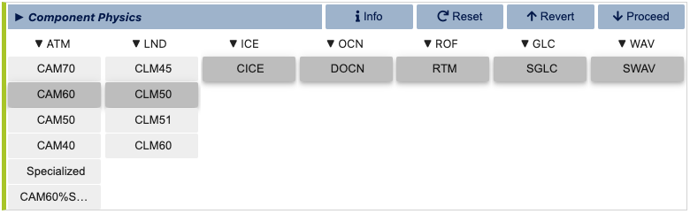
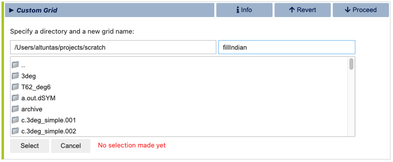
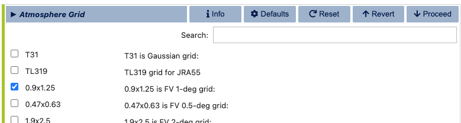
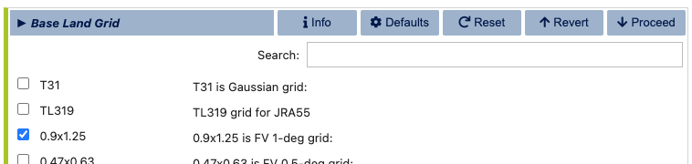
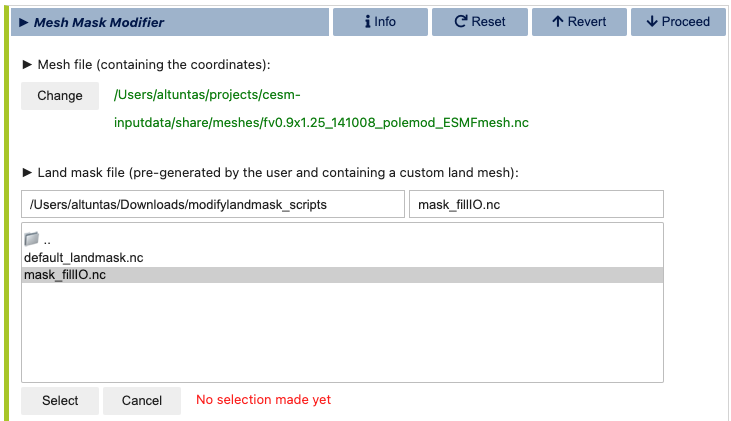
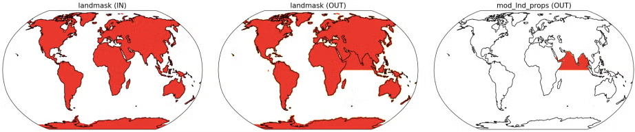
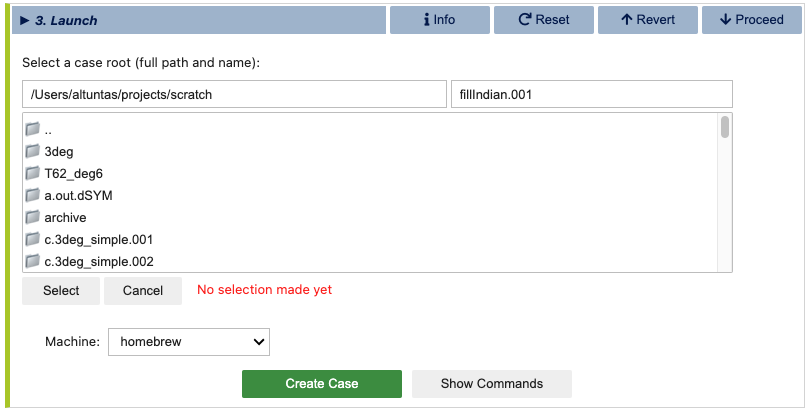
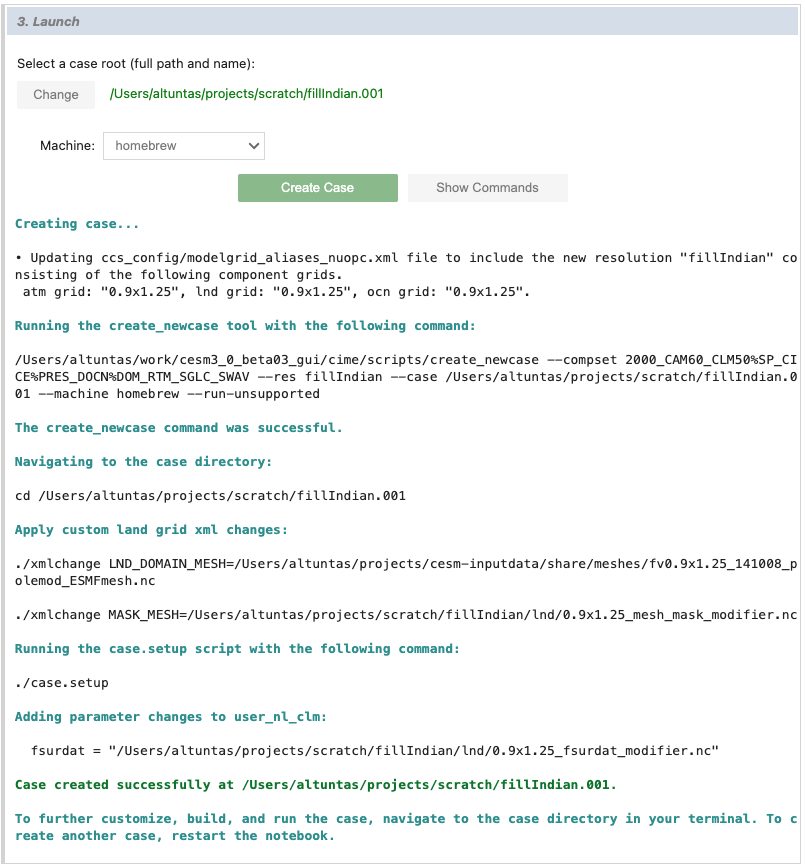

Fill Indian Ocean
=================

In this tutorial, we'll walk through the process of modifying the continental geometry
in an uncoupled CESM case, where we'll fill the Indian Ocean with land and these new
land points will be specified as c4-grass.

Stage 0: Open visualCaseGen
---------------------------

Follow the instructions in the :ref:`Open` to open visualCaseGen in your Jupyter notebook
environment.

Stage 1: Select Compset
-----------------------

After having executed the cell with the command `from visualCaseGen import gui; gui`,
and clicking the **Start** button, you will see the main interface of visualCaseGen. 

Click the **Custom** button to proceed with creating a custom compset.

.. image:: assets/Stage1_1.png

Initialization time
~~~~~~~~~~~~~~~~~~~

Select `2000` as the initialization time period. This selection is appropriate for
fixed-time-period runs with present-day conditions.

.. image:: assets/stage1_5.png

Models
~~~~~~

Once you've selected the initialization time, visualCaseGen will prompt you to select the
models for each component class. For this ridge world case, select the following component
options: `cam` as the atmosphere model, `clm` as the land model, `cice` as the ice model,
`docn` (data ocean) as the ocean model, rtm as the river transport model, sglc (stub land ice)
as the land ice model, and `swav` (stub wave) as the wave model. After all the selections are
made, the model matrix should look like:

Model Physics
~~~~~~~~~~~~~

Having selected the models, you will proceed to select the physics options for each model. The physics
settings determine the complexity of each model component and impact computational requirements.
For this example, select the `CAM60` physics option for the atmosphere model and `CLM50` as 
the land physics. For the remaining models, there are no multiple physics options available, so
the default physics settings are automatically selected.

Component Options (Modifiers)
~~~~~~~~~~~~~~~~~~~~~~~~~~~~~

You are now ready to finalize the compset by selecting optional physics modifiers. Navigate between
tabs for each component options to select the desired options. For this example, make the 
following selections:

 - **ATM**: `(none)`
 - **LND**: `SP` (satellite phenology)
 - **ICE**: `PRES` (prescribed)
 - **OCN**: `DOM` (prescribed)
 - **ROF**: `(none)`
 - **WAV**: `(none)`
 - **RTM**: `(none)`

Stage 2: Grid
----------------------
Having completed the compset configuration, you will now proceed to the `Grid` stage.
To be able to fill the Indian Ocean with land, you will need to create a custom grid,
so click the **Custom** button to proceed.

.. image:: assets/Stage2_1.png

When the `Custom` button is clicked, you will be prompted to specify a directory where
the grid files will be stored and a new, unique grid name, .e.g., `fillIndian` for this example.

Atmosphere Grid
~~~~~~~~~~~~~~~

After selecting your grid directory and assigning a name, click the "Select" button to initiate
the process of constructing your new grid. You will do this by individually selecting the grids
for the atmosphere, ocean, and land. First, you will be prompted to select the atmosphere
grid. Note that, unlike the ocean and land grids, the atmosphere grid is not customizable within
visualCaseGen. Therefore, you must select from the pre-existing options. For this example, choose
the standard 1-degree resolution grid: "0.9x1.25."

Ocean Grid
~~~~~~~~~~

Since DOCN (data ocean) is the ocean model selected for this compset, the ocean grid will be
automatically set to the same grid as the atmosphere model. Therefore, you do not need to make
any selections for the ocean grid. However, you will have the option to customize the 
land/ocean mask in the land grid section.

Land Grid
~~~~~~~~~

In the final step of the custom grid configuration, you will be prompted to select the land grid.
Since the continental geometry is to be modified, select the `Modified` land grid mode:

.. image:: assets/ridge10.png

In the `Base Land Grid` selection dialog, choose the `0.9x1.25` grid to be consistent with
the atmosphere grid:

Having selected the base land grid, you will now be prompted specify the land/ocean mask.
This is done in the `Mesh Mask Modifier` subsection of the land grid configuration.
When an active ocean model (i.e., MOM6) is present, the land/ocean mask is set by the ocean
model grid. However, since the ocean model for this compset is DOCN, you will need to specify
the land/ocean via the `Mesh Mask Modifier` dialog, which should initially look like:

.. image:: assets/fillindian4.png

The visualCaseGen tool auto-completes the (default) mesh file, if available, and prompts you
to select the custom land mask file to be pre-generated by the user. This file, which should
be in NetCDF format, should contain the following variables:

.. list-table:: Custom Land Mask File Variables 
   :widths: 30 70
   :header-rows: 1

   * - Variable name
     - Description
   * - landmask(lsmlat,lsmlon)
     - 1's for land, 0's elsewhere
   * - mod_lnd_props(lsmlat,lsmlon)	
     - mask where the surface properties will be altered (1's for modification, 0's elsewhere)
   * - lats(lsmlat)
     - grid latitudes
   * - lons(lsmlon)
     - grid longitudes

If the latitude and longitude variables are not the same as the names specified above,
make sure to update the corresponding variable and dimension names in the
`Mesh Mask Modifier` dialog.

For this example, we provide a custom land mask file named `mask_fillIO.nc` where the Indian Ocean
is filled with land. 
Download the following tar file containing this custom land mask file and the Jupyter notebook
that was used to generate it, along with the original land mask file:
:download:`modifylandmask_scripts.tar <https://files.cesm.ucar.edu/models/simple/tar/modifylandmask_scripts.tar>` 

After downloading the tar file, extract the contents and specify the path to the custom land mask file
in the `Mesh Mask Modifier` dialog:

This custom land mask is shown in the below figure where the first image shows the original land mask,
the second image shows the custom land mask with the Indian Ocean filled with land, and the third
image shows the difference between the two masks:

Once the modified land mask file path is specified and the variables are correctly set, click the
**Run mesh mask modifier** button to apply the custom land mask to the mesh file. This may
take a few minutes to complete. Once the process is finished, you will automatically proceed to
the second and final step of the custom land grid configuration: `fsurdat` file generation.

In the `fsurdat` file generation dialog, you will be prompted to configure and run the `fsurdat`
tool to modify the surface data of the selected land grid. The properties to configure and modify
include soil properties, vegetation properties, urban areas, etc. (See CLM documentation for more
information.) visualCaseGen will automatically select the input surface data file (fsurdat)
if it exists in the CESM input data directory of the system you are using. Otherwise, you will
need to download and provide the path to the appropriate fsurdat file. Similarly, the tool
will automatically select the custom land mask file you provided in the previous step for the 
specification of customized area. Fill in the remaining fields as shown below:

.. image:: assets/fillindian7.png

Now, click the green **Run fsurdat_modifier** button to generate the modified fsurdat file. This
process may take a few minutes to complete. Once the process is finished, you will automatically
proceed to the `Launch` stage.

Stage 3: Launch
----------------------

The final stage of visualCaseGen is the `Launch` stage, where you bring your CESM case to
life with the selected compset and grid configuration. In this stage, you'll find tools to
select the case directory, choose a target machine, and initiate case creation. 

.. image:: assets/Stage3_1.png

First, click **Select**
to choose the case directory and enter a unique casename, then click **Select** again to confirm.

Then confirm the target machine or select a different machine if needed. If the machine requires a project ID,
you will be prompted to enter it here. At this point, you are ready to create the case. Before doing so, you can
click **Show Commands** to view the terminal commands that will be executed. Once ready, click **Create Case** to
initiate case creation. If the case creation is successful, you will see a completion log detailing all the steps
taken to create the case and a confirmation of the successful case creation along with the path to the new case directory:

