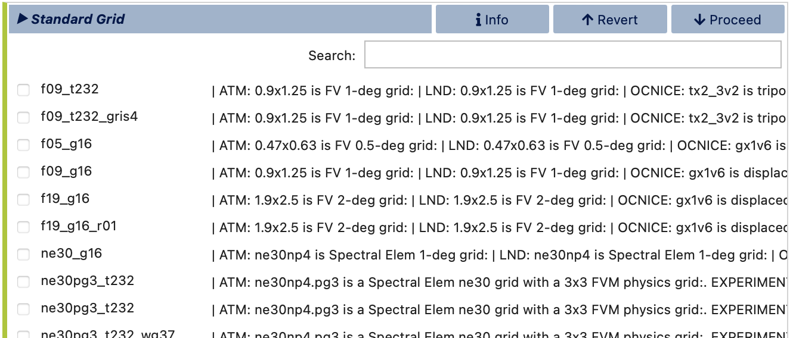
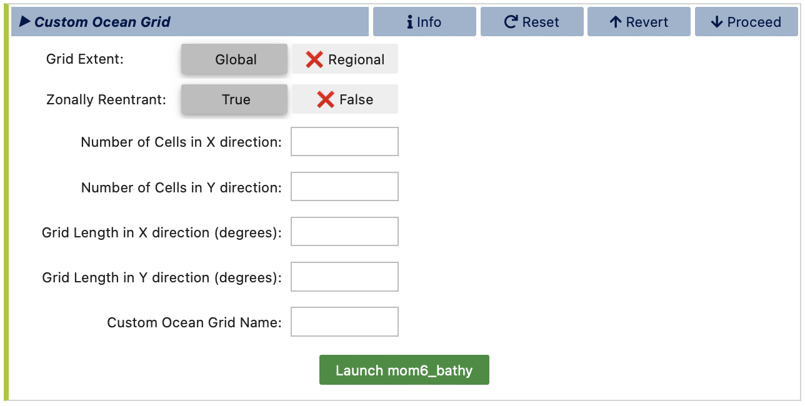
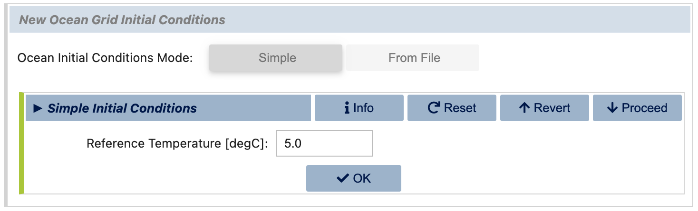
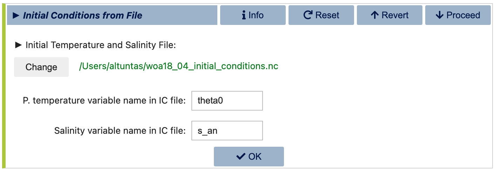
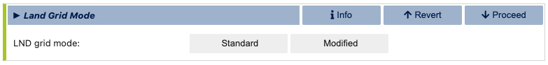
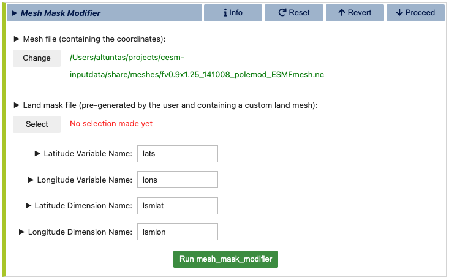
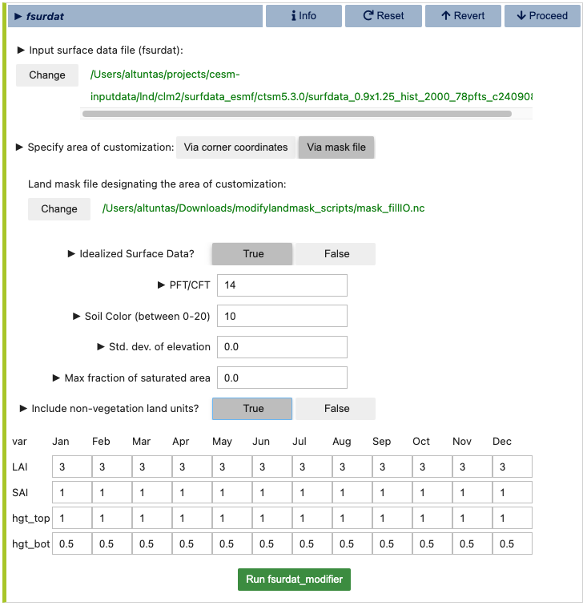

Stage 2/3: Grid
===============

The second major step in configuring your CESM case is choosing a resolution, which
is a specific set of grids for each active and data model in the compset. You may 
select either a standard, out-of-the-box resolution or create a custom one by combining
existing model grids. In `Custom` mode, you can also generate custom model grids for CLM and/or MOM6
using auxiliary tools included in visualCaseGen. Begin by selecting between `Standard`
and `Custom` grid modes.

.. image:: assets/Stage2_1.png

.. note:: In CESM terminology, *resolution* and *grid* are often used interchangeably,
   both referring to the combination of model grids used in a CESM simulation. Unless 
   specifically noted as a *model grid* (i.e., a grid unique to a particular component,
   such as the ocean grid), the term *grid* in this context should be understood as
   *resolution*, meaning the full collection of *model grids* used in a particular CESM case.

Standard Grids
------------------

Select from the available list of resolutions (combinations of model grids) below.
Resolutions known to be incompatible with your chosen compset have been omitted 
from this list. Use the search box to refine the list further. For exact matches,
use double quotes; otherwise, the search will display all grids containing one 
or more of the search terms.

After selecting a grid, visualCaseGen will advance to the `Launch` stage, where
you can create your CESM case using the chosen compset and grid configuration.

Custom Grids
------------------

In Custom Grid mode, you can build a custom grid by mixing and matching standard 
model grids or generating new MOM6 and/or CLM grids with specialized tools that come with visualCaseGen.
Start by specifying a path to save the new grid files and a name to refer to this
new grid in the configuration process and beyond.

.. image:: assets/Stage2_3.png

After clicking `Select`, a file browser will open to help you locate your preferred
directory for saving the new grid files. Once the directory is selected, enter the
new grid name in the text box at the top right and click `Select` to proceed.

.. image:: assets/Stage2_4.png

Atmosphere Grid
~~~~~~~~~~~~~~~

Next, choose an atmosphere grid from the list of compatible options based on the
compset you selected in the `Compset` stage. You may use the search box to filter
the list further. Note that, currently, visualCaseGen does not support the creation
of custom atmosphere grids. Therefore, you can only select from the standard atmosphere
grids available in the list. The selected standard atmosphere grid will then be included
in the custom resolution that you are building.

.. image:: assets/Stage2_5.png

Ocean Grid
~~~~~~~~~~

For the ocean grid, if MOM6 is selected as the ocean model, you can either select a standard
ocean grid or create a new MOM6 grid. When creating a new MOM6 grid, you'll specify parameters
such as grid extent and resolution, after which you'll be directed to a separate notebook that
uses the `mom6_bathy` tool to generate the new grid and bathymetry.

If using a standard ocean grid, select one from the list compatible with your chosen compset
and atmosphere grid. If creating a new MOM6 grid, complete the required parameters, then proceed
to launch the `mom6_bathy` tool for final customization.

After specifying all ocean grid parameters, click `Launch mom6_bathy`. This will open an 
auto-generated Jupyter notebook where you can fine-tune the ocean grid, topography, and vertical grid.
You can then generate the corresponding MOM6 input files, which will be saved under `ocnice` subdirectory
within the directory you specified earlier for saving the new grid files.
For more details on mom6_bathy, refer to its documentation: https://ncar.github.io/mom6_bathy/

.. note:: If the `mom6_bathy` notebook doesn't open automatically, make sure that your browser allows
  pop-ups from visualCaseGen. If the notebook still doesn't open, you can manually launch it by
  navigating to the `mom6_bathy_notebooks/` directory in your visualCaseGen installation and opening
  the notebook corresponding to your custom grid.

Ocean Initial conditions
~~~~~~~~~~~~~~~~~~~~~~~~~~~~

If you are creating a new MOM6 grid, you will also need to specify the initial conditions for the ocean model.
You can either specify a simple initial conditions by providing a uniform reference temperature, (salinity
will be fit accordingly) or you can provide an initial conditions file including potential temperature and salinity.
The initial conditions file doesn't need to be defined on the same grid as the one you are creating, since
MOM6 will interpolate the data to the new grid at runtime. 

Below dialog corresponds to the simple initial conditions specification:

The alternative dialog allows you to specify an initial conditions file instead:

.. note:: **MOM6 initial Conditions File:**
    You can download the standard "World Ocean Atlas" initial conditions file used in CESM
    simulations from the following link: https://svn-ccsm-inputdata.cgd.ucar.edu/trunk/inputdata/ocn/mom/tx2_3v2/woa18_04_initial_conditions.nc

Land Grid
~~~~~~~~~

Following ocean grid selection or creation, you'll move to land grid selection if CLM is chosen
as the land model. Here, you can similarly select a standard land grid from the list of
available options based on your compset, or you can create a new CLM grid by selecting the
`Modified` land grid mode, which allows you to define a custom land mask and land surface properties for CLM.

In case of a `Modified` land grid, you will first need to select a base land grid for customization.

.. image:: assets/Stage2_7.png

Next, you will be prompted specify the land/ocean mask. This is done in the Mesh Mask Modifier
subsection of the land grid configuration. Note, however, that when an active ocean model
(i.e., MOM6) is present, the land/ocean mask is set by the ocean model grid. And, hence,
this stage is skipped in that case. The Mesh Mask Modifier dialog is shown below:

In this dialog, you will first need to provide a *land mesh file* that contains the coordinates of the land domain.
This file is typically auto-filled with a default mesh path if found. The second field requires a
*land mask file*, which is a user-created file that defines the final land mask. This file, which should
be in NetCDF format, should contain the following variables:

.. list-table:: Custom Land Mask File Variables 
   :widths: 30 70
   :header-rows: 1

   * - Variable name
     - Description
   * - landmask(lsmlat,lsmlon)
     - 1's for land, 0's elsewhere
   * - mod_lnd_props(lsmlat,lsmlon)	
     - mask where the surface properties will be altered (1's for modification, 0's elsewhere)
   * - lats(lsmlat)
     - grid latitudes
   * - lons(lsmlon)
     - grid longitudes

If the latitude and longitude variables are not the same as the names specified above,
make sure to update the corresponding variable and dimension names in the
`Mesh Mask Modifier` dialog. Finally, click the *Run mesh_mask_modifier* button to generate 
the new land mask file to be used. This process may take a few minutes to complete.

Once the land mask is set (either by the ocean model grid or by the user), you can proceed to
configuring the land surface dataset. This is done  in the `fsurdat` file generation dialog, 
where you will be prompted to configure and run the `fsurdat` tool to modify the surface data of
the selected land grid. The properties to configure and modify
include soil properties, vegetation properties, urban areas, etc. (See CLM documentation for more
information.) visualCaseGen will automatically select the input surface data file (fsurdat)
if it exists in the CESM input data directory of the system you are using. Otherwise, you will
need to download and provide the path to the appropriate fsurdat file. Similarly, the tool
will automatically select the custom land mask file you provided in the previous step for the 
specification of customized area. Otherwise, manually provide the path to the custom land mask file
that contains *Custom Land Mask File Variables* as provided in the table above.
Below is an example of the `fsurdat` file generation dialog:

Once ready, click the green **Run fsurdat_modifier** button to generate the modified fsurdat file. This
process may take a few minutes to complete. 

.. note:: **Initialization of Custom Land Points:**
  When users define their own continental geometries, the model initializes land points
  by reading an initial conditions file (`finidat` specified in the CLM namelist). The model 
  interpolates the nearest neighbor information to populate land points that lack existing data.

.. note:: **Runoff Behavior with Idealized Land:**
    In scenarios with idealized land configurations, the new land points do not have an 
    updated routing map to direct water downstream. As a result, runoff from these land points
    is routed to the nearest ocean point. To verify that water is not lost in the process, users
    can consult the budget tables available in the log files.
    These tables provide detailed information on water budgets and confirm the conservation of water within the model.

Once atmosphere, ocean, and land grids have been chosen or created, custom grid setup is complete.
visualCaseGen will guide you to the final stage, `Launch`, where you can create a CESM case based on
the specified compset and grid.