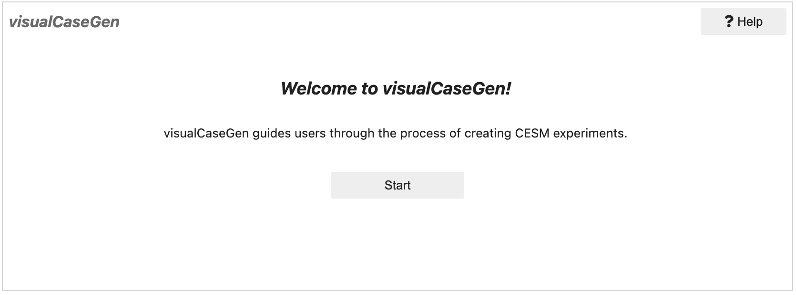
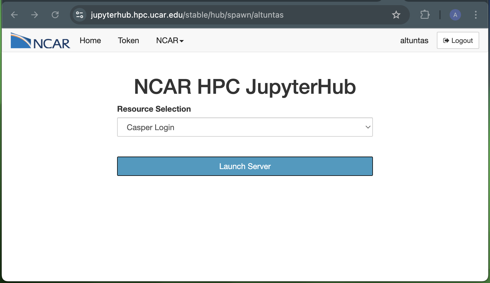

Opening the GUI
===============================

Once the conda environment is installed, you can launch visualCaseGen by opening the `GUI.ipynb` notebook
in the `visualCaseGen/` directory. Below are several common methods for launching the notebook. If you are
using NCAR machines, the JupyterHub interface is recommended.

.. contents:: Launch Options:
   :depth: 2
   :local:

From the Command Line
---------------------------------------

.. warning::
  The command-line launch is possible only if you’re running on a local machine or have SSH tunneling
  enabled. For remote access, set up SSH tunneling (described in the next section).

Ensure the `visualCaseGen` Conda environment is activated. If not, activate it with:

.. code-block:: bash

    conda activate visualCaseGen

Launch the notebook from the command line by navigating to the `visualCaseGen/` directory 
where `GUI.ipynb` notebook is located and running:

.. code-block:: bash

    jupyter-lab GUI.ipynb

This will open the Jupyter notebook in your default web browser, displaying a cell with the following code:

.. code-block:: python

    from visualCaseGen import gui; gui

To start the GUI, execute the cell by clicking the **Run** button or pressing `Shift + Enter`. You should
see the following welcome dialog. Click **Start** to begin using the GUI:

- Once the `Start` button is clicked, a loadbar will appear, indicating that the GUI is initializing. When the
  GUI is ready, the main interface will be displayed. If the loadbar hangs, click the `Help` button on the top
  right corner of the welcome dialog to see if any error messages are displayed. If you encounter any issues,
  please refer to the Troubleshooting section of this documentation.

On a Remote Machine
-------------------------------------

To access the GUI on a remote machine, set up SSH tunneling with port forwarding. 

- Establish an SSH connection with port forwarding (the exact command may vary depending on your system):

.. code-block:: bash

    ssh -L 8888:localhost:8888 username@remote_host

- After connecting, activate the `visualCaseGen` Conda environment, navigate to the `visualCaseGen/` directory, and run:

.. code-block:: bash

    conda activate visualCaseGen
    cd [PATH_TO_visualCaseGen] # e.g., ~/cesm3_0_beta03_gui/visualCaseGen
    jupyter-lab GUI.ipynb --no-browser

If the above steps are successful, the command line will display a URL that you can copy and paste into your web browser
to access the Jupyter notebook. The URL will look similar to:

.. code-block:: bash

    http://localhost:8888/lab/?token=1234567890abcdef1234567890abcdef1234567890abcdef

Paste the url **shown in your own terminal** into your web browser to access the visualCaseGen GUI. A Jupyter
notebook with the following cell will be displayed:

.. code-block:: python

    from visualCaseGen import gui; gui

To start the GUI, execute the cell by clicking the **Run** button or pressing `Shift + Enter`. You should
see the following welcome dialog. Click **Start** to begin using the GUI:

- Once the `Start` button is clicked, a loadbar will appear, indicating that the GUI is initializing. When the
  GUI is ready, the main interface will be displayed. If the loadbar hangs, click the `Help` button on the top
  right corner of the welcome dialog to see if any error messages are displayed. If you encounter any issues,
  please refer to the Troubleshooting section of this documentation.

NCAR JupyterHub
-------------------------------------

.. warning::
  This method is available only to users with access to NCAR systems like `derecho` or `casper`.

- Go to NCAR JupyterHub in your web browser:

.. code-block:: bash

    https://jupyterhub.hpc.ucar.edu/

- Log in by selecting "Production" under "Available NCAR Resources," then enter your NCAR credentials.
  
- Start a JupyterHub server by clicking the **"start"** button under the Actions column.

.. image:: assets/launch1.png

- When prompted, select a resource. Although any resource is acceptable, "Casper Login" is recommended, as visualCaseGen does not require significant computational power.

- After the resource starts, navigate to the `visualCaseGen/` directory from the File Browser tab on the left.

.. tip::
  Create a symbolic link to your CESM directory in your home directory for easier access.

- Open the `GUI.ipynb` notebook by double clicking on it,

.. image:: assets/launch3.png

- When prompted, select the visualCaseGen Conda kernel from the dropdown menu. (If not prompted, select the kernel by clicking
  the kernel name in the top right corner of the notebook.)

.. image:: assets/launch4.png

- To start the GUI, execute the first cell (with `from visualCaseGen import gui; gui`) by clicking the **Run** button
  or pressing `Shift + Enter`. You should see the following welcome dialog. Click **Start** to begin using the GUI:

- Once the `Start` button is clicked, a loadbar will appear, indicating that the GUI is initializing. When the
  GUI is ready, the main interface will be displayed. If the loadbar hangs, click the `Help` button on the top
  right corner of the welcome dialog to see if any error messages are displayed. If you encounter any issues,
  please refer to the Troubleshooting section of this documentation.

