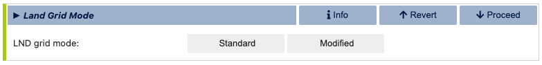

Ridge World
==============================

This example provides step-by-step guidance on generating a coupled idealized configuration
consisting of an aquaplanet with polar land caps and a narrow land ridge extending between
the two poles. This setup is similar to the configuration used in `Wu et al (2021) <https://agupubs.onlinelibrary.wiley.com/doi/full/10.1029/2021GL093966>`_ .
The example demonstrates how to use the visualCaseGen GUI to select CESM components, configure
custom ocean and land input files, and set up the final case.

Unlike standard CESM cases, this example involves significant modifications, including
customizations to the ocean grid, bathymetry, and land surface
properties.

.. note:: A video demonstration of this example is available `at this link <https://www.youtube.com/watch?v=YwBqcIlW_fg>`_.

Stage 0: Open visualCaseGen
---------------------------

Follow the instructions in the :ref:`Open` to open visualCaseGen in your Jupyter notebook environment.

Stage 1: Select Compset
-----------------------

After having executed the cell with the command `from visualCaseGen import gui; gui`,
and clicking the **Start** button, you will see the main interface of visualCaseGen. 

Click the **Custom** button to proceed with creating a custom compset for our idealized
Ridge World configuration.

.. image:: assets/stage1_1.png

Initialization time
~~~~~~~~~~~~~~~~~~~

Once the `Custom` button is clicked, you will be prompted to select the initialization time.
For this example, select `1850` as the initialization time.

.. image:: assets/stage1_5.png

Models
~~~~~~

Once you've selected the initialization time, visualCaseGen will prompt you to select the
models for each component class. For this ridge world case, select the following component options:
`cam` as the atmosphere;
`clm` as the land component; `cice` as the ice component; `mom` as the ocean component, `srof` 
(i.e., stub run off) as the river component; `sglc` (i.e., stub land ice) as the land ice component;
and, `swav` (i.e. stub wave) as the wave component. After all the selections are made, the 
model matrix should look like:

.. image:: assets/ridge1.png

Model Physics
~~~~~~~~~~~~~

Having selected the models, you will proceed to select the physics options for each model. The physics
settings determine the complexity of each model component and impact computational requirements.
For this example, select the following physics options which are based on the selections
made in `Wu et al (2021) <https://agupubs.onlinelibrary.wiley.com/doi/full/10.1029/2021GL093966>`_ :

.. image:: assets/ridge2.png

Component Options (Modifiers)
~~~~~~~~~~~~~~~~~~~~~~~~~~~~~

You are now ready to finalize the compset by selecting optional physics modifiers. Navigate between
tabs for each component options to select the desired options. For this example, select `(none)` for all the
components except for the `clm` component, which should be set to the satellite phenology (SP) mode.
This options enables various aspects of the land model such as
leaf-area index are prescribed as opposed to being prognosed interactively by the land biogeochemistry.

.. image:: assets/ridge3.png

Stage 2: Grid
----------------------
Having completed the compset configuration, you will now proceed to the `Grid` stage. This can
either be a "Standard" grid, i.e., a ready-made grid that comes with CESM, or a "Custom" grid
where you can mix-and-match existing model grids or create new ones.

.. image:: assets/Stage2_1.png

Select the `Custom` grid option to be able to mix-and-match an existing atmosphere grid with a custom
ocean grid and a modified land grid.

.. image:: assets/Stage2_3.png

When the `Custom` button is clicked, you will be prompted to specify a directory where
the grid files will be stored and a new, unique grid name, .e.g., `myRidgeGrid` for this example.

.. image:: assets/ridge4.png

Atmosphere Grid
~~~~~~~~~~~~~~~

After selecting your grid directory and assigning a name, click the "Select" button to initiate
the process of constructing your new grid. You will do this by individually selecting the grids
for the atmosphere, ocean, and land. First, you will be prompted to select the atmosphere
grid. Note that, unlike the ocean and land grids, the atmosphere grid is not customizable within
visualCaseGen. Therefore, you must select from the pre-existing options. For this example, choose
the standard 1-degree resolution grid: "0.9x1.25."

.. image:: assets/ridge5.png

Ocean Grid
~~~~~~~~~~

For the MOM6 model grid, you have the option to either use a standard grid
or create a custom grid. For this example, select the `Create New`
option the create a custom, idealized MOM6 grid.

Selecting the `Create New` option will prompt you to specify several high-level grid properties
as shown below. Notice the `Regional` and `Zonally Reentrant` options are crossed out.
You can click on these options to view a message explaining why they are currently unavailable.

.. image:: assets/Stage2_6.png

For the remaining grid properties, configure them as follows: specify 360 cells in the x-direction
and 180 cells in the y-direction. Set the total grid length to 360 degrees in the x-direction and
180 degrees in the y-direction. This will result in a 1-degree lat-lon grid. Note that the grid length
refers to the total extent of the grid across all cells, not the size of an individual cell. Finally,
assign a unique name to your custom ocean grid.

After specifying all ocean grid parameters, click the green **Launch mom6_bathy** button. This will open an auto-generated
Jupyter notebook where you can further customize the ocean bathymetry and generate all necessary grid input files.

The mom6_bathy tool
~~~~~~~~~~~~~~~~~~~

.. important:: If the `mom6_bathy` notebook doesn't open automatically, make sure that your browser allows
  pop-ups from visualCaseGen. If the notebook still doesn't open, you can manually launch it by
  navigating to the `mom6_bathy_notebooks/` directory in your visualCaseGen installation and opening
  the notebook corresponding to your custom grid.

Once the auto-generated `mom6_bathy` notebook is open, you will see a series of cells that guide you through
the process of creating your custom ocean bathymetry. Before proceeding, make sure that the appropriate
kernel is selected in the top right corner of the notebook. Then, execute the first two cells to import
the necessary libraries and to instantiate the `Grid` object. Notice that the `Grid` object is initialized
with the parameters you specified in visualCaseGen.

The third section of mom6_bathy is where a custom bathymetry may be defined. The default option is to produce
a flat ocean bottom of depth 2000m. We are going to instead generate an ocean that
resembles the ridge world case of `Wu et al (2021) <https://agupubs.onlinelibrary.wiley.com/doi/full/10.1029/2021GL093966>`_ ,
which has a depth 4000m with some sinusoidal fluctuations, a land ridge of width 1 degree longitude and
the furthest poleward 10 degrees latitude at the poles set to land. We will specify this analytically with python
code within mom6_bathy.

First, instantiate the topo object by running the cell below. Note that the `min_depth` parameter, which
is set to 10.0m by default determines the minimum bathymetric depth for a cell to be considered ocean.
Cells with depths less than this value will be masked as land.

.. code-block:: python

    # Instantiate the bathymetry object
    topo = Topo(grid, min_depth = 10.0)

Once the `topo` object is created, remove the contents of the cell below where the bathymetry is by default
set to a flat ocean of depth 2000m.

.. code-block:: python

    # Set the bathymetry to be a flat bottom with a uniform depth of 2000m
    topo.set_flat(D=2000.0)

Replace the content of the above cell with the following code to set the bathymetry to the ridge world configuration:

.. code-block:: python

    # Adding in the bathymetry resembling that in Wu et al (2021)
    import numpy as np
    # Setting up the 2-Dimensional longitudes and latitudes of the grid
    i = grid.tlat.nx.data
    j = grid.tlat.ny.data[:np.newaxis]
    x, y = np.meshgrid(i,j)
    # Setting up the 4000 m ocean with sinusoidal fluctuations of 500 m height
    custom_depth = 4000. + 400. * np.sin(x*np.pi/20) * np.cos(y*np.pi/20)
    # Set up the ridget at 50 east:
    custom_depth[:, 50]= 0.
    # Set up polar land caps
    custom_depth[0:10,:] = 0.
    custom_depth[-10:,:] = 0.
    # Update the depth attribute:
    topo.depth = custom_depth

Once the above code is executed, you will have set up the 4000 m deep option, with sinusoidal fluctuations and set the
depth of the ocean to 0 at all latitudes at 50 degrees east and at all longitudes over the 10 degrees latitude range at the poles.
You can plot the bathymetry to see the results by running the cell below:

.. image:: assets/ridge9.png

Vertical Grid
~~~~~~~~~~~~~

Next, you will need to set up the vertical grid. In the `mom6_bathy` notebook, 
a default vertical grid is provided, which consists of 20 layers, and a ratio of 10,
which means that the thicknesses of layers gradually increase with depth, and the thickness
of the bottom layer is 10 times thicker than the top layer.

.. code-block:: python

    # Create a vertical grid
    vgrid = VGrid.hyperbolic(
      nk    = 20,             # number of layers 
      depth = topo.max_depth, # Do NOT modify this argument 
      ratio = 10.0, # ratio of top to bottom layer thicknesses (=1.0 for uniform layers)
    )
    print('layer thicknesses:', vgrid.dz)

Save all grid input files
~~~~~~~~~~~~~~~~~~~~~~~~~

Finally, run the cell below to save all the grid input files. These include the MOM6 supergrid, topography, and 
vertical grid files (needed by MOM6), CICE grid file (needed by the sea ice model), and the ESMF mesh file
(needed by the CESM coupler).

.. warning:: The paths specified in the cell below are for illustrative purposes only. Do not modify the paths
    in your auto-generated `mom6_bathy` notebook. The paths are unique to the user's system and should not be changed,
    since doing so will prevent visualCaseGen from confirming that the grid files have been successfully generated
    and will prevent configuring CESM accurately.

.. code-block:: python

    # Do NOT modify this cell!

    # MOM6 supergrid file.
    grid.write_supergrid(f"/Users/altuntas/projects/scratch/myRidgeGrid/ocnice/ocean_grid_my1deg_grid_f2343a.nc")

    # Save MOM6 topography file:
    topo.write_topo(f"/Users/altuntas/projects/scratch/myRidgeGrid/ocnice/ocean_topog_my1deg_grid_f2343a.nc")

    # Save MOM6 vertical grid file:
    vgrid.write(f"/Users/altuntas/projects/scratch/myRidgeGrid/ocnice/ocean_vgrid_my1deg_f2343a.nc")

    # CICE grid file:
    topo.write_cice_grid(f"/Users/altuntas/projects/scratch/myRidgeGrid/ocnice/cice_grid.my1deg_grid_f2343a.nc")

    # Save ESMF mesh file:
    topo.write_esmf_mesh(f"/Users/altuntas/projects/scratch/myRidgeGrid/ocnice/ESMF_mesh_my1deg_grid_f2343a.nc")

After running the cell above, return to visualCaseGen and click the **Confirm completion** button to proceed.

Ocean Initial Conditions
~~~~~~~~~~~~~~~~~~~~~~~~~

Next, you will be prompted to specify the initial conditions for the ocean model. For this example, 
select the `Simple Initial Conditions` options and set the reference temperature to `5` degrees Celsius.
This will set the initial temperature of the ocean to 5 degrees Celsius, and the salinity will be adjusted
accordingly. 

.. image:: assets/Stage2_6_1.png

Land Grid
~~~~~~~~~

In the final step of the custom grid configuration, you will be prompted to select the land grid. Since the continental
geometry is idealized in this example, select the `Modified` land grid mode:

In the `Base Land Grid` selection dialog, choose the `0.9x1.25` grid to be consistent with the atmosphere grid:

.. image:: assets/ridge11.png

Based on the selection of the base land grid, you will be prompted to configure and run the `fsurdat` tool to modify
the surface data of the selected land grid. The properties to configure and modify include soil properties,
vegetation properties, urban areas, etc. (See CLM documentation for more information.) visualCaseGen will automatically
select the input surface data file (fsurdat) if it exists in the CESM input data directory of the system you are using.
Otherwise, you can download the following fsurdat file from the CESM input data repository:
https://svn-ccsm-inputdata.cgd.ucar.edu/trunk/inputdata/lnd/clm2/surfdata_esmf/ctsm5.3.0/surfdata_0.9x1.25_hist_1850_78pfts_c240908.nc

If the `"Input surface data file (fsurdat)"` is not already auto-filled, download the above file and provide the path to it in the
`"Input surface data file (fsurdat)"` field.

.. image:: assets/ridge12.png

Now, click the green **Run fsurdat_modifier** button to generate the modified fsurdat file. This can take a few minutes to complete.
Once it has completed, you will automatically proceed to the final stage.

Stage 3: Launch
---------------

The final stage of visualCaseGen is the `Launch` stage, where you bring your CESM case to
life with the selected compset and grid configuration. In this stage, you'll find tools to
select the case directory, choose a target machine, and initiate case creation. 

First, click **Select**
to choose the case directory and enter a unique casename, then click **Select** again to confirm.

Then confirm the target machine or select a different machine if needed. If the machine requires a project ID,
you will be prompted to enter it here. At this point, you are ready to create the case. Before doing so, you can
click **Show Commands** to view the terminal commands that will be executed. 

.. important:: If CESM is not installed on your system, the selected machine will appear as `CESM_NOT_PORTED` and the
  **Create Case** button will be disabled. In this case, you can still print out the commands that would be executed
  to create the case by clicking the **Show Commands** button. You can then follow the printed commands and instructions
  on a system where CESM is installed to create the case manually.

Once ready to proceed, click **Create Case** to
initiate case creation. If the case creation is successful, you will see a completion log detailing all the steps
taken to create the case and a confirmation of the successful case creation along with the path to the new case directory:

.. image:: assets/ridge14.png