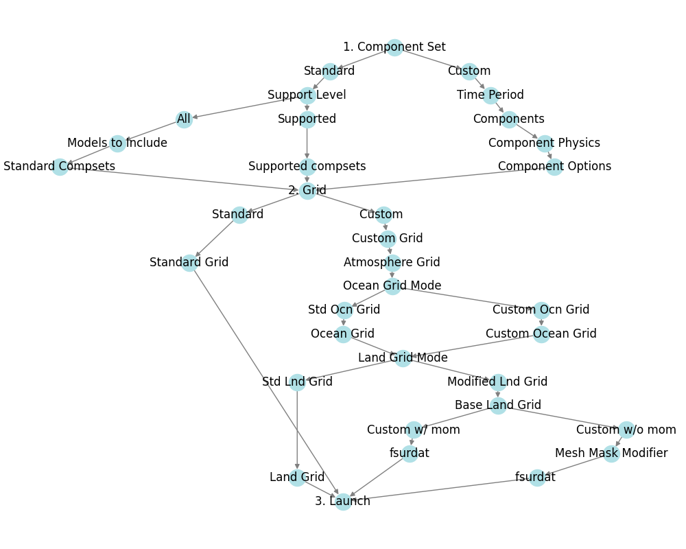
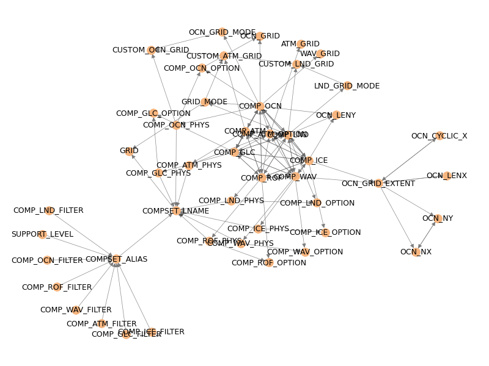

# Summary

visualCaseGen is a graphical user interface (GUI) designed to streamline the
creation and configuration of Community Earth System Model (CESM) experiments.
Developed at the NSF National Center for Atmospheric Research (NCAR), CESM is a
leading climate model capable of simulating the Earth's climate system at
varying levels of complexity. However, configuring custom CESM experiments
requires intricate knowledge of component compatibility, grid settings,
parameterization choices, and model hierarchies, making the setup process
complex and time-consuming for unique or breakthrough applications.
visualCaseGen provides a user-friendly interface that simplifies these tasks,
significantly reducing setup time and improving ease of use for modelers.

To ensure consistency and compatibility, visualCaseGen incorporates a constraint
solver based on satisfiability modulo theories (SMT). This solver systematically
analyzes dependencies between experiment settings, detects conflicts, and
provides detailed explanations of incompatibilities, allowing users to make
informed adjustments.

On the frontend, visualCaseGen is implemented as a Jupyter-based GUI, offering
an intuitive, step-by-step interface for browsing standard CESM configurations,
defining custom experiment setups, and modifying grid and component settings.
Additionally, the tool features point-and-click utilities for creating and
modifying ocean bathymetry, along with custom land surface property tools,
further simplifying model customization.

By automating and simplifying CESM configuration, visualCaseGen makes the model
more accessible and custumizable, particularly for researchers exploring
hierarchical modeling, idealized experiments, or custom coupled simulations.
As such, the tool allows users to focus on their scientific objectives rather than
technical setup challenges, ultimately enabling a more efficient and streamlined
experiment workflow.


# Statement of need

The Community Earth System Model (CESM) is a highly flexible and comprehensive
climate modeling system that allows researchers to simulate the interactions
between the atmosphere, ocean, land, ice, and river systems. While this
flexibility enables a wide range of scientific experiments, it also makes model
configuration highly complex and time-consuming. Setting up custom CESM experiments
requires navigating intricate component compatibility constraints, grid
configurations, and parameterization choices, often demanding extensive
expertise in the model’s internal structure. For non-standard
experiments, users must manually modify XML an namelist files, maintain
numerical and scientific consistency, and troubleshoot compatibility issues, a
process that is error-prone, tedious, and time-intensive.

visualCaseGen was developed to overcome these usability barriers and streamline
the CESM experiment setup process. As a GUI, visualCaseGen eliminates the need
for manual modifications and provides an intuitive, structured approach to
constructing new model configurations. It enables users to browse standard CESM
setups, create custom model configurations, and modify grids with ease,
significantly reducing setup complexity and time. By automating tedious
configuration tasks, visualCaseGen empowers researchers to focus on scientific
exploration rather than technical setup, streamlining model utilization for both
idealized and sophisticated climate modeling studies.

# Constraint Solver

One of the main challenges in configuring Community Earth System Model (CESM)
experiments is ensuring that different model settings remain compatible. CESM’s
configuration involves numerous interdependent components, grids, and
parameterization choices, many of which have strict compatibility constraints.
visualCaseGen addresses this challenge by integrating an SMT-based constraint
solver, built using the Z3 solver [@de2008z3]. Z3 was chosen for its ability to
efficiently manage complex logical relationships and reason about compatibility
constraints, making it well-suited for handling CESM’s intricate configuration
dependencies.

In visualCaseGen, constraints are specified as key-value pairs, where the key
represents a Z3 logical expression defining a condition, and the value is the
error message displayed when the constraint is violated. The following examples
illustrate constraints of increasing complexity:

```python

LND_DOM_PFT >= 0.0:
    "PFT/CFT must be set to a nonnegative number",

Implies(OCN_GRID_EXTENT=="Regional", OCN_CYCLIC_X=="False"):
    "Regional ocean domain cannot be reentrant (due to an ESMF limitation.)",

Implies(And(COMP_OCN=="mom", COMP_LND=="slnd", COMP_ICE=="sice"), OCN_LENY<180.0):
    "If LND and ICE are stub, custom MOM6 grid must exclude poles (singularity).",

```

These constraints enforce scientifically consistent model configurations, preventing
users from selecting incompatible options.

## Why Use a Constraint Solver?

Configuring CESM is inherently a constraint satisfaction problem (CSP), which
can quickly become computationally complex as the number of configuration
variables increases. Manually enforcing constraints would be impractical, making
an SMT solver an ideal choice. The benefits of using a solver include:

- **Detecting Hidden Conflicts:** Individual constraints may be satisfied
  independently, yet their combination can lead to conflicts that are nontrivial
  to detect manually.

- **Preventing Dead-Ends:** Without a solver, users may unknowingly select
  settings that lead to an unsatisfiable configuration, forcing them to restart
  their setup. Thanks to the solver, visualCaseGen dynamically guides users
  toward valid options.

- **Enabling Constraint Analysis:** The solver can answer critical questions, such as:
  - Are all constraints satisfiable?
  - Are there unreachable options that need adjustment?
  - Are any constraints redundant and can be optimized?

- **Scalability and Efficiency:** As the number of variables and constraints grows
  exponentially, manually checking compatibility becomes infeasible. The 
  solver efficiently handles large-scale constraint resolution, ensuring rapid
  feedback even for large number of configuration variables.

 
# The Stage Mechanism

A key backend concept in visualCaseGen is the Stage Mechanism, which structures
the CESM configuration process into consecutive steps (stages). Each stage
includes a set of related configuration variables that can be adjusted together.
Based on the user's selections, different stages are activated dynamically,
guiding the user through a structured workflow.

## Stage Pipeline

All possible stage paths collectively form the stage pipeline,
which dictates:

 - The sequence in which configuration variables are presented to the user. 
 - The precedence of variables: earlier stages have higher priority over later ones.



A key complexity arises when the same variable appears in multiple stages. This
is allowed as long as the variable is not reachable along the same path within
the stage pipeline. To prevent cyclic dependencies, therefore, the stage pipeline must form
a directed acyclic graph (DAG), ensuring:

 - A consistent variable precedence hierarchy.
 - No looping or contradictions in variable settings.

## Constraint Graph

Using the stage pipeline and specified constraints, visualCaseGen constructs a
constraint graph, as shown in Figure \autoref{fig:cgraph}. In this graph:

 - Nodes represent configuration variables. 
 - Directed edges represent dependencies or constraints between variables.
 - Edges are directed from higher-precedence variables to lower-precedence variables.
 
This constraint graph enforces the correct order of
configuration steps, ensuring that dependencies are resolved before
lower-priority settings are adjusted.




## Interactive Constraint Checking

During the configuration process, when a user makes a selection, the constraint
graph is traversed to identify all variables that are affected by the selection.
This traversal is done in a breadth-first manner, starting from the selected
variable and following the edges in the direction of the constraints. The
traversal stops at variables whose options validities are not affected by the
selection. As such the traversal is limited to the variables that are directly
or indirectly affected by the user's selection, which in turn depends on the
the user input, stage hierarchy, and the specified constraints., Below is 
visualCaseGen's simplified interactive constraint checking algorithm:

--- 

| **Algorithm: Interactive Constraint Checking** |
|------------------------------------------------|
|### **Input:** |
|- `selected_var`: The configuration variable modified by the user. |
|- `selected_val`: The new value chosen for `selected_var`. |
|- `constr_graph`: The constraint graph. |
|- `constraints`: A dictionary mapping constraints to their corresponding error messages. |
|- `valid_options`: A dictionary mapping each variable to its currently valid options. |
| |
|### **Output:** |
|- If `selected_val` is invalid, return the associated **error message(s)**. |
|- Otherwise, update `valid_options` for all affected variables. |
| |
|### **Algorithm:** |
| |
|1. **Check for Immediate Constraint Violations**   |
|   - If `selected_val` is invalid:   |
|     - **Return the associated error message(s)** to the user.   |
|     - **Exit the algorithm** without propagating changes.   |
|   - Evaluate the **constraints** related to `selected_var` using  **Z3**. |
| |
|2. **Initialize Traversal**   |
|   - Create a queue `Q` and enqueue `selected_var`. |
|   - Initialize a set `visited = {selected_var}` to track processed variables. |
| |
|3. **Breadth-First Traversal for Constraint Propagation**   |
|   - While `Q` is not empty: |
|     1. **Dequeue** `current_variable` from `Q`. |
|     2. **Retrieve all dependent variables** `D` from `constr_graph` that have edges from `current_variable`. |
|     3. **For each dependent variable** `var ∈ D`: |
|        - If `var` is already in `visited`, **skip it**. |
|        - **Evaluate constraints** involving `var`: |
|          - Call the **Z3 solver** to check which options remain valid for `var`. |
|          - Update `valid_options[var]` accordingly. |
|        - If `valid_options[var]` has changed: |
|          - Enqueue `var` into `Q`. |
|          - Add `var` to `visited`. |
| |
|4. **Terminate**   |
|   - Stop when all affected variables have been updated. |
|   - If any variable has no remaining valid options, **return an appropriate error message**. |
| |
|By dynamically re-evaluating constraints and adjusting available options, |
|visualCaseGen provides real-time feedback, preventing invalid configurations and |
|ensuring scientific consistency in CESM setups. |


# Frontend 

ipywidgets, traitlets, ...

highly portable, robust, familiar to scientists, ...


# Workflow 

With either configuration mode, visualCaseGen 
enhances the setup process by flagging incompatible options and providing
detailed descriptions of constraints, guiding users to make informed and
valid choices in their experiment designs. This framework makes CESM 
experiment configuration more accessible, significantly reducing setup time
and expanding the range of modeling applications available to users.


In standard
mode, users can explore and select from predefined (1) *component sets*, 
i.e., collection of models to be coupled, along with physics packages and
other high-level option for each individual model, and 
(2) *resolutions*, i.e., combinations of grids representing each component’s
spatial domains. In custom
configuration mode, users can further extend CESM’s capabilities by creating
unique component sets and resolutions, mixing complexity levels across 
components and generating idealized or sophisticated configurations suited to 
specific research goals. 

# Remarks


# Figures

Figures can be included like this:

and referenced from text using \autoref{fig:example}.

Figure sizes can be customized by adding an optional second parameter:
{ width=20% }

# Acknowledgements

We acknowledge ...

# References

