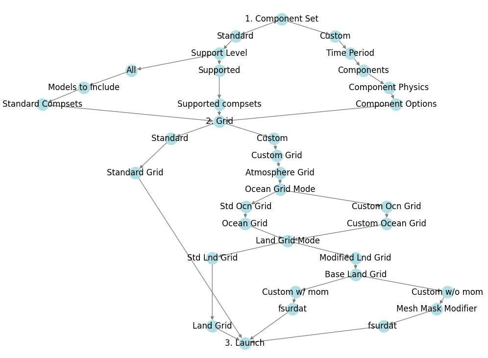

# Summary

visualCaseGen is a graphical user interface (GUI) that streamlines the setup of
Community Earth System Model (CESM) experiments. While CESM supports simulations
across a wide range of spatial and temporal scales and complexities [@danabasoglu2020community],
configuring non-standard experiments can be technically demanding and time-consuming.

To simplify this process, visualCaseGen offers a Jupyter-based interface 
that guides users through each configuration stage and automates key tasks. 
It features a constraint solver based on satisfiability modulo theories 
(SMT) [@de2011satisfiability], which validates settings in real time by analyzing
dependencies, detecting conflicts, and explaining incompatibilities. A complementary
*Stage Mechanism* structures the workflow to manage variable precedence and to enforce
constraints in a targeted and efficient manner.

The frontend enables users to explore standard configurations or define custom
experiments, with tools for editing input files such as ocean grids, bathymetry,
and land properties. By reducing setup burden and the potential for errors, visualCaseGen
makes CESM more accessible, particularly for hierarchical modeling [@maher2019model],
idealized experiments [@polvani2017less], and custom coupled simulations, thereby
allowing researchers to focus on scientific goals rather than technical challenges.

# Statement of need

Setting up custom CESM experiments requires navigating complex compatibility
constraints across components, physics options, parameterizations, and model
grids. These non-standard setups often involve mixing and matching settings,
modifying code, editing runtime parameter files, maintaining consistency,
and resolving conflicts. This process is time-consuming, error-prone, and can
take weeks to produce a working configuration.

A study by @wu2021coupled exemplifies these challenges. The authors configured
an idealized CESM experiment to explore atmosphere-ocean interactions using two
aquaplanet models: one with no continents, and another with a pole-to-pole land
strip to investigate effects on Hadley circulation, equatorial upwelling, and 
precipitation (\autoref{fig:wuEtAl}). Achieving this required extensive manual
effort: modifying the CESM codebase, generating custom inputs, adjusting parameters,
consulting domain experts, and iterating through trial and error.

visualCaseGen was developed to address these barriers. As an interactive GUI,
it eliminates manual steps and provides an intuitive workflow for
building CESM configurations efficiently.

![Sea surface temperature and precipitable water distribution from Aqua and
Ridge planet simulations using CESM [@wu2021coupled].
\label{fig:wuEtAl}](wuEtAl.png){height="270pt"}

# Constraint Solver

One of the main challenges in configuring CESM experiments is ensuring
compatibility among model settings, such as components, physics,
grids, and parameterizations, which often have strict interdependencies.
visualCaseGen addresses this
challenge by integrating an SMT-based constraint solver, built using the Z3
solver [@de2008z3], which offers a robust Python API and supports multiple
parameter types (integers, reals, booleans, and strings), enabling 
specification and enforcement of complex constraints in CESM configurations.

In visualCaseGen, constraints are specified as key-value pairs, where the key
represents a Z3 logical expression defining a condition, and the value is the
error message displayed when the constraint is violated. These constraints
enforce compatibility rules and prevent invalid model configurations. Below
are three example constraints with increasing complexity,
demonstrating how the SMT solver can enforce simple value bounds, conditional
dependencies, and more complex multi-component rules:

## Why Use a Constraint Solver?

Configuring CESM is inherently a constraint satisfaction problem (CSP) that can
become computationally complex as the number of configuration variables grows.
For this reason, we use an SMT solver, which offers several advantages:

- **Detecting Hidden Conflicts:** Individual constraints may be satisfied
  independently, yet their combination can lead to conflicts that are nontrivial
  to detect manually.

- **Preventing Dead-Ends:** The solver guides users away from unsatisfiable
  configurations.

- **Enabling Constraint Analysis:** The solver can determine if constraints are satisfiable,
  identify unreachable options, and detect redundancies.

- **Scalability and Efficiency:**  The solver efficiently manages large, complex 
  constraint sets.
 
# The Stage Mechanism

A core backend concept in visualCaseGen is the Stage Mechanism, which breaks the
CESM configuration into consecutive stages, each grouping related variables that
can be adjusted together. Stages activate dynamically based on user selections.
This mechanism also enables the constraint solver to incrementally apply only relevant
constraints per stage, which improves performance and responsiveness.

The stage pipeline (see \autoref{fig:pipeline}) defines the sequence of stages
and variable precedence, with earlier stages having higher priority. Variables
may appear in multiple stages if they are not on the same path. A critical 
requirement is that the pipeline forms a directed acyclic graph (DAG) to prevent 
cycles and inconsistencies.

{height="300pt"}

## Constraint Graph and its Traversal

Using the stage pipeline and constraints, visualCaseGen builds a constraint graph
(\autoref{fig:cgraph}) where nodes are configuration variables and directed edges
represent dependencies, pointing from higher to lower-precedence variables.

When the user makes a selection, the graph is traversed breadth-first from that
variable, identifying all affected variables. Traversal stops at variables 
unaffected by the selection. This dynamic traversal, guided by user input, 
stage hierarchy, and constraints, allows real-time feedback by re-evaluating
constraints and adjusting options to prevent invalid configurations and ensure
consistency.

# Frontend 

The visualCaseGen frontend provides an interactive interface for
configuring CESM experiments. Built with Jupyter ipywidgets, it
can operate on local
machines, HPC clusters, and cloud environments. This portability and flexibility allows
researchers to configure CESM experiments efficiently, whether prototyping
lightweight simulations on personal computers or running sophisticated applications
on remote supercomputing systems.

\autoref{fig:Stage1_7} displays an example stage from the visualCaseGen GUI,
where users can select the individual models to be coupled in their CESM
experiment. As the user makes selections, the GUI dynamically updates available
options by crossing out incompatible choices, ensuring that only valid
configurations are selectable. This interactive feedback guides the user
toward compatible model setups.

{width="90%"}

At any stage, users can click on crossed-out options to see a brief explanation
of why that choice is incompatible with their current selections (\autoref{fig:Stage1_8}). This helps users make informed adjustments.

{width="90%"}

As another example of streamlining model customization, \autoref{fig:TopoEditor}
shows the TopoEditor widget that comes with visualCaseGen. This tool allows users
to interactively modify ocean bathymetry, enhancing customizability and
ease of use.

{width="90%"}

# Remarks

visualCaseGen can significantly speed up custom CESM experiment setup by
automating much of the configuration process. Instead of manual edits, 
users define setups via an interactive GUI, mixing components, physics,
and parameterizations, and generating custom input files. 
The SMT-based solver ensures only valid settings are chosen. While
complex cases may require fine-tuning, initial working configurations 
can be created in hours rather than weeks. To our knowledge, visualCaseGen
is the first tool to integrate SMT-based constraint solving into Earth system
model configuration, demonstrating how formal methods can aid this process.

# Acknowledgements

This work was supported by the NSF Cyberinfrastructure for Sustained Scientific
Innovation (CSSI) program under award number 2004575.

The NSF National Center for Atmospheric Research (NCAR) is a major facility
sponsored by the NSF under Cooperative Agreement No. 1852977.

# References

